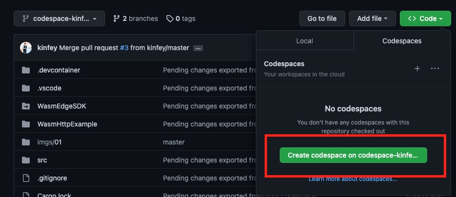
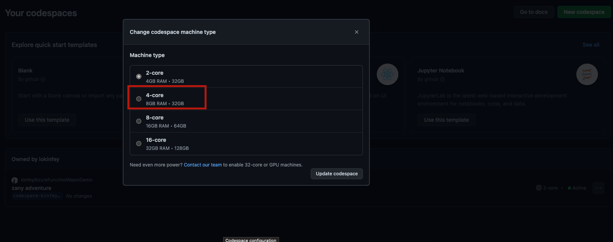
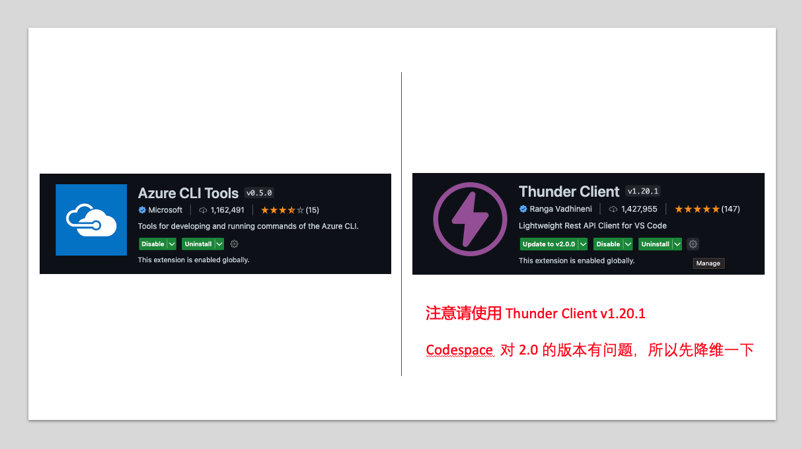
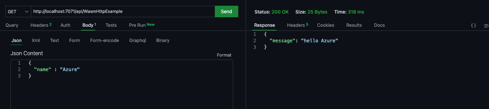
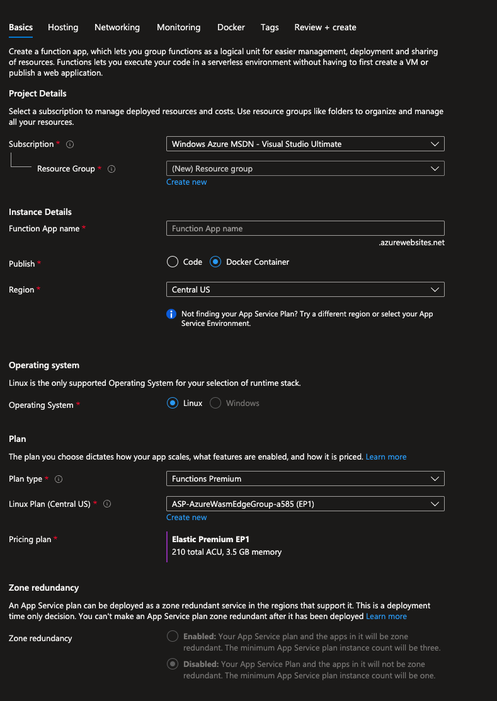
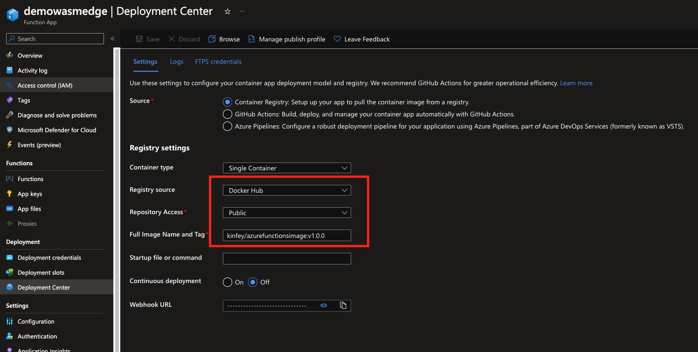
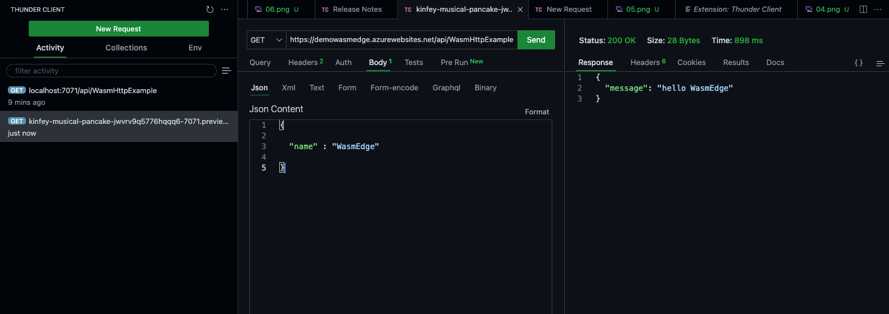

# **WasmEdge in Azure Function - : Hello World**

<div style="text-align:left; width:100%">

</div>

Hey Guy ，这是一个 WasmEdge 在 Azure Function 上运行的 Hello World 。 希望能给应用 WasmEdge 时提供一些场景案例。请 Fork 这个项目然后在你的 Github Codespace 上运行

## **准备工作**

1. Azure 账号免费申请 https://azure.com/free 

2. Azure 学生账号申请 https://aka.ms/studentgetazure

3. 申请 GitHub Education Package https://education.github.com/pack 

4. 注册 GitHub https://github.com/signup 

5. 注册一个 Docker Hub https://hub.docker.com/ 

## **环境配置**

1. 你需要有一个 GitHub 账号， 从 2022 年 11 月开始 ，GitHub 开始提供每月 60 小时的免费使用


<div style="text-align:center; width:50%">

</div>

2. 直接选择改 Repo 上的 Code ，进入该项目的环境 Codespace 环境, 

<div style="text-align:left; width:100%">

</div>

建议小伙伴把 Codespace 设置为 4 核心 GPU ， 8GB 内存 ， 32 GB 存储


<div style="text-align:left; width:100%">

</div>


3. 安装好相关插件 ThunderClient 以及 Azure CLI 

<div style="text-align:left; width:100%">

</div>

4. 在终端安装好 Azure Function CLI ， 运行以下命令

```bash

curl https://packages.microsoft.com/keys/microsoft.asc | gpg --dearmor > microsoft.gpg

sudo mv microsoft.gpg /etc/apt/trusted.gpg.d/microsoft.gpg

sudo sh -c 'echo "deb [arch=amd64] https://packages.microsoft.com/debian/$(lsb_release -rs | cut -d'.' -f 1)/prod $(lsb_release -cs) main" > /etc/apt/sources.list.d/dotnetdev.list'

sudo apt-get update

sudo apt-get install azure-functions-core-tools-4

```

5. WasmEdge SDK 预备环境

```bash

 sudo apt-get update
 
 sudo apt-get install -y software-properties-common libboost-all-dev ninja-build
          
 sudo apt-get install -y llvm-14-dev liblld-14-dev clang-14
                  
 sudo apt-get install -y gcc g++ clang
        
 sudo apt-get install -y libssl-dev pkg-config gh

```

注意： 因为该项目依赖 WasmEdge SDK 0.7.0 版本，而 WasmEdge SDK 还没有在 Crates 上发布，所以项目在 GitHub 上 fork 了 WasmEdge SDK 的源码(https://github.com/WasmEdge/WasmEdge/)， 进行本地项目的依赖和编译

6. Rust 环境配置

```bash

rustup default nightly

```

7. WasmEdge 环境安装

```bash

chmod 755 ./install_libwasmedge.sh

sudo ./install_libwasmedge.sh

```


## **在 GitHub Codespace 上运行 Azure Function 运行环境**

1. 在终端，编译完整的 handler

```bash

cargo build --release 

cp target/release/handler . 

```

2. 继续在终端输入 

```
 func start

```

3. 打开 Thunder Client ，输入 , 完成测试


<div style="text-align:left; width:100%">

</div>


## **打包成容器**

1. 在 Github Codespace 终端，执行以下命令

```bash

docker login --username {你 Docker Hub 上的 docker id} --password {你 Docker Hub 上的密码}

```

2. 在 Github Codespace 终端，打包 container

```bash

docker build --tag <DOCKER_ID>/azurefunctionsimage:v1.0.0 .

```

3. 推送该 container 到 Docker Hub

```bash

docker push <docker_id>/azurefunctionsimage:v1.0.0

```


## **部署到 Azure Function**

1. 打开你的 Azure Portal portal.azure.com


2. 添加 Resource , 选择 Function


<div style="text-align:left; width:100%">

</div>

3. 在添加 Azure Function 页面，选择用 Container 方式部署，以及使用 Linux Container


<div style="text-align:left; width:100%">

</div>


4. 创建成功后，去 Container Deployment ， 设置好你对应的 Docker Hub 和 container 标识，按保存

<div style="text-align:left; width:100%">

</div>


5. 稍等片刻完成，在 Codespace 上打开 Thunder Client 验证

<div style="text-align:left; width:100%">

</div>


