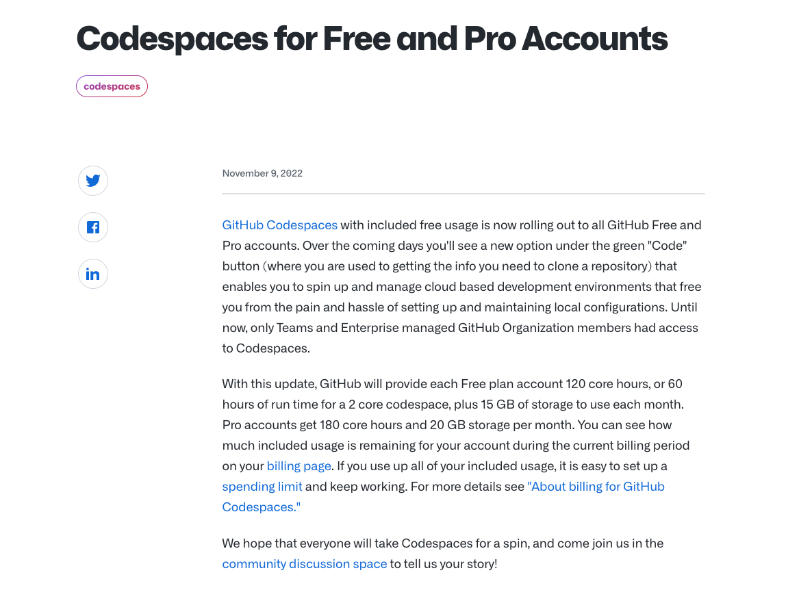
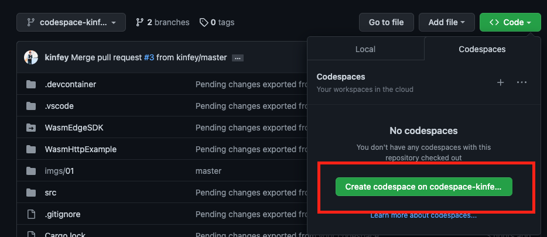
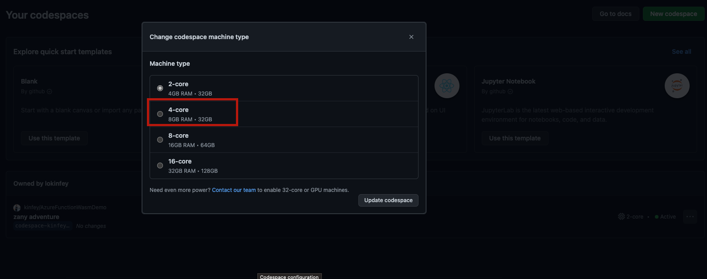
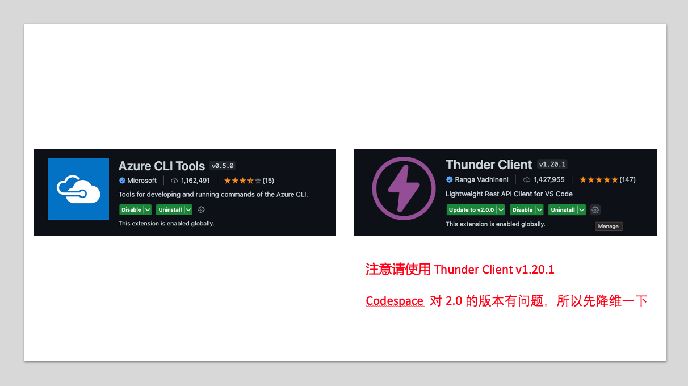
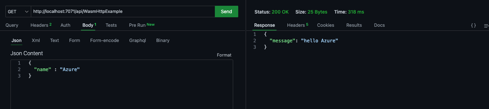
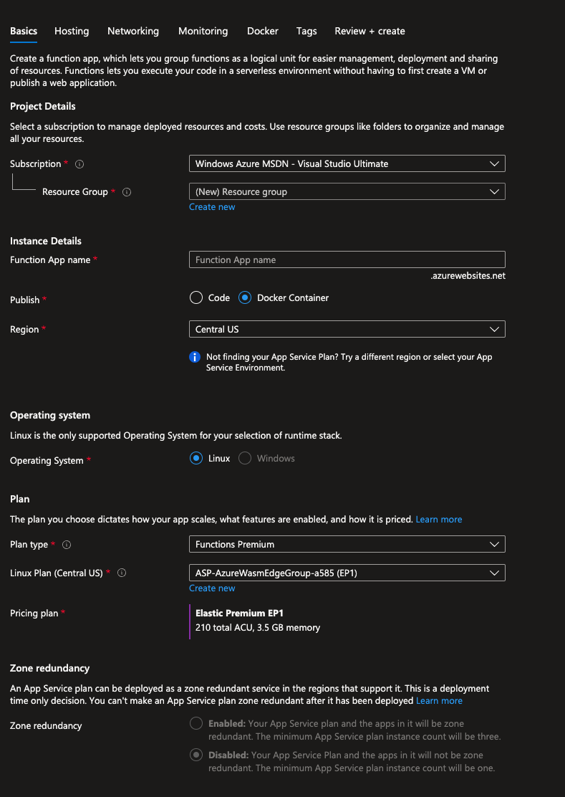
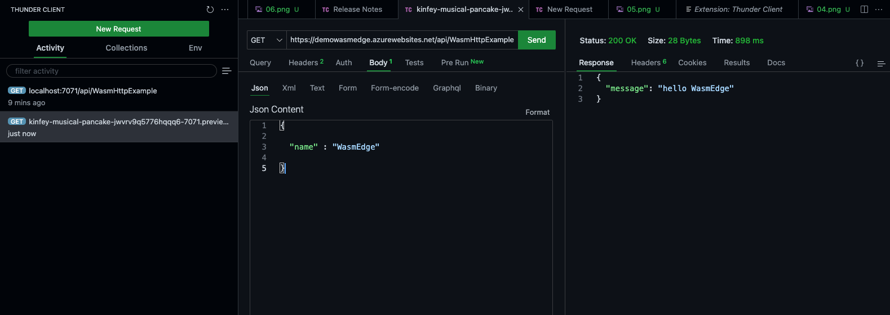

# **WasmEdge in Azure Function - : Hello World**

<div style="text-align:left; width:100%">

</div>

Hey Guy, this is a Hello World of WasmEdge application on Azure Function. I hope to provide some scenarios for the application of WasmEdge. Please fork this project and run it on your Github Codespace

## **Preparation**

1. Free application for Azure account https://azure.com/free

2. Azure student account application https://aka.ms/studentgetazure

3. Apply for GitHub Education Package https://education.github.com/pack

4. Sign up on GitHub https://github.com/signup

5. Register a Docker Hub https://hub.docker.com/

## **Configuration**

1. You need to have a GitHub account, starting from November 2022, GitHub will provide 60 hours of free usage per month


<div style="text-align:center; width:50%">

</div>

2. Directly choose to change the Code on the Repo to enter the environment Codespace environment of the project,

<div style="text-align:left; width:100%">

</div>

It is recommended that set Codespaces to 4-core GPU, 8GB memory, and 32 GB storage


<div style="text-align:left; width:100%">

</div>


3. Install related extensions ThunderClient and Azure CLI

<div style="text-align:left; width:100%">

</div>

4. Install Azure Function CLI in the terminal, run the following command

```bash

curl https://packages.microsoft.com/keys/microsoft.asc | gpg --dearmor > microsoft.gpg

sudo mv microsoft.gpg /etc/apt/trusted.gpg.d/microsoft.gpg

sudo sh -c 'echo "deb [arch=amd64] https://packages.microsoft.com/debian/$(lsb_release -rs | cut -d'.' -f 1)/prod $(lsb_release -cs) main" > /etc/apt/sources.list.d/dotnetdev.list'

sudo apt-get update

sudo apt-get install azure-functions-core-tools-4

```

5. WasmEdge SDK Build Env

```bash

 sudo apt-get update
 
 sudo apt-get install -y software-properties-common libboost-all-dev ninja-build
          
 sudo apt-get install -y llvm-14-dev liblld-14-dev clang-14
                  
 sudo apt-get install -y gcc g++ clang
        
 sudo apt-get install -y libssl-dev pkg-config gh

```


6. Rust Env

```bash

rustup default nightly

```

7. Install WasmEdge SDK 

```bash

chmod 755 ./install_libwasmedge.sh

sudo ./install_libwasmedge.sh

```


## **Run the Azure Function  on GitHub Codespace**

1. 在In the terminal, compile  handler

```bash

cargo build --release 

cp target/release/handler . 

```

2. continue to input 

```
 func start

```

1. Open Thunder Client to  test


<div style="text-align:left; width:100%">

</div>


## **Package into container**

1. In the Github Codespace terminal, execute the following command

```bash

docker login --username {你 Docker Hub 上的 docker id} --password {你 Docker Hub 上的密码}

```

2. In the Github Codespace terminal, package the container

```bash

docker build --tag <DOCKER_ID>/azurefunctionsimage:v1.0.0 .

```

3. push container to Docker Hub

```bash

docker push <docker_id>/azurefunctionsimage:v1.0.0

```


## **Deploy to Azure Function**

1. Open Azure Portal portal.azure.com


2. Add Resource , 选择 Function


<div style="text-align:left; width:100%">

</div>

3. Choose Linux Container


<div style="text-align:left; width:100%">

</div>


4. Goto Container Deployment ， Set your Docker Hub & container id，and Save

<div style="text-align:left; width:100%">

</div>


5. Wait a monment ， In Codespace open Thunder Client to test

<div style="text-align:left; width:100%">

</div>


## **Thanks**


